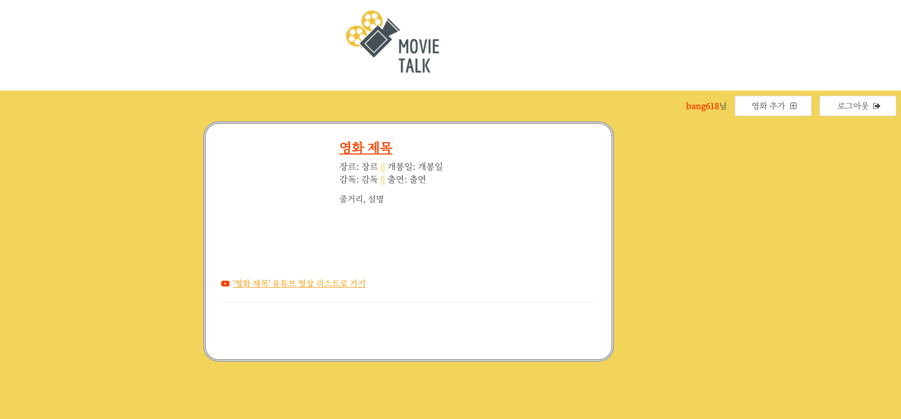

 # week1_team20 Mini Proejct

# Hangehae 99. (99Days Web Dev Bootcamp) 

  Week 1 :  [Movie Talk].  (2021.06.07- 2021.06.10)
#### Team : 이동민 (Dongmin Lee),   방민수 (Skyler Bang ), 최지혁 (Jihyuk Choi) , 김수연 (Sooyeon Kim)

 
 

## Proejct Scopre

 1. Project Name 
     MovieTALK(무비톡)

 2. Project Background

     Do you want to share your favorite movie with your friends? 
     Please ask them to join our MovieTalk 
     We can share the movie and leave the comments 

3. Implemented Features 

    Sign up
      Create an Account
         -Check ID
         -Check PW 
      Log in

      Log out 

      Search Movie by Title

      Add Movie in to Main Feed

      Check Detail of movie 

      Leave Comment 
 
 
4. Requriementes 

   -Must use Jinja2 template 
   
   -Must use JWT authentication

5. Demo video

 Demonstration Video : https://www.youtube.com/watch?v=8Gbv7yYv2qM
 
 
 
  

   

## Detail
* 

  

   Unfold
  

     

    Result Pictures
     
    Login Page 
     
      
     Main Page  with dummy DB 
      
      
      Main Page  with actual DB if the movie is added from the serach page
      
      
       Search page.  serach the movie from Naver Movie and can add to the main page
      
      
        Singup page
      
 
    * ## Frontend
    * 

        
디자인

         
       
            
        초안 2   
         
           
        초안 1 발전   
        
        

         

  

   
  
  
